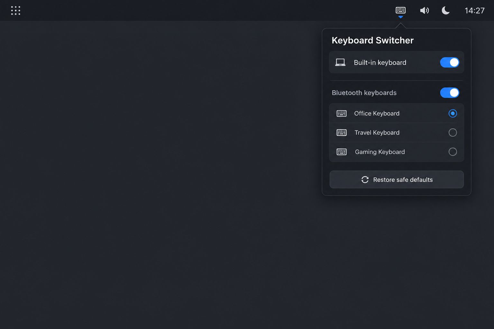

# Keyboard Switcher

Keyboard Switcher adds a small keyboard icon to the Omarchy bar. Click it with
the trackpad to independently enable or disable the laptop's built-in keyboard
and connected Bluetooth keyboards.



## Safety

- The trackpad is never included in a toggle group.
- The plugin only toggles keyboard devices Hyprland currently reports.
- Unknown or ambiguous devices are displayed as **Unclassified** and are not
  disabled.
- State is session-scoped. Both groups start enabled after login or reboot.
- **Restore safe defaults** enables all confidently identified keyboards.
- Esc and Caps Lock are not remapped by this plugin.

Omarchy plugins run as unsandboxed code inside the long-running shell process.
Read the source and [SECURITY.md](SECURITY.md) before installing.

## Install

The provisional development ID is `io.github.dev.keyboard-switcher`. Before a
community release, replace `dev` with the publisher's real GitHub namespace in
`manifest.json`, `BarWidget.qml`, `Panel.qml`, `shell.json`, and the README.

From a public GitHub repository:

```sh
omarchy plugin add https://github.com/REPLACE-ME/omarchy-keyboard-switcher.git --enable
omarchy bar move io.github.dev.keyboard-switcher --section right
```

For this local checkout, run the safe installer from the repository root:

```sh
./install-local.sh
omarchy plugin validate ~/.config/omarchy/plugins/io.github.dev.keyboard-switcher
omarchy-shell shell rescanPlugins
omarchy plugin enable io.github.dev.keyboard-switcher right
```

The installer backs up `~/.config/hypr/input.lua` and
`~/.config/omarchy/shell.json` before changing them. It removes only the active
`kb_file` line that suppresses Esc and Caps Lock and inserts the widget once
before Bluetooth.

## Use

1. Click the keyboard icon in the top bar.
2. Click **Built-in keyboard** to turn the laptop keyboard off or on.
3. Click **Bluetooth keyboards** to turn all currently connected Bluetooth
   keyboards off or on together.
4. Use **Restore safe defaults** if you want every confidently identified
   keyboard enabled again.

The panel shows individual device names and states. A mixed group is shown as
**Mixed**; clicking it enables the whole group. Bluetooth devices are refreshed
automatically, so connecting or disconnecting a keyboard is reflected without
restarting the shell.

## Requirements

- Omarchy Quattro with Quickshell plugin support.
- Hyprland with `hyprctl` available at `/usr/bin/hyprctl`.
- `udevadm` available at `/usr/bin/udevadm`.
- Python 3 at `/usr/bin/python3` (standard library only at runtime).

No root privileges, services, network access, or additional runtime packages
are required.

## Remove

```sh
omarchy plugin remove io.github.dev.keyboard-switcher
```

Plugin removal does not change the trackpad, Bluetooth radio, keyboard layout,
or XKB files. If you used `install-local.sh`, the timestamped backups beside
`input.lua` and `shell.json` remain available for manual recovery.

## Development and validation

```sh
UV_CACHE_DIR=/tmp/keyboard-switcher-uv-cache \
UV_PROJECT_ENVIRONMENT=/tmp/keyboard-switcher-uv-env uv run pytest -q
omarchy plugin validate .
/usr/lib/qt6/bin/qmllint -I "$OMARCHY_PATH/shell" \
  BarWidget.qml Panel.qml DeviceService.qml
```

The standalone `qmllint` command may warn that Omarchy's runtime-only `qs.*`
modules are unresolved; the Omarchy manifest validator must still exit 0, and
the live shell is the final QML integration check.

## License

MIT — see [LICENSE](LICENSE).
